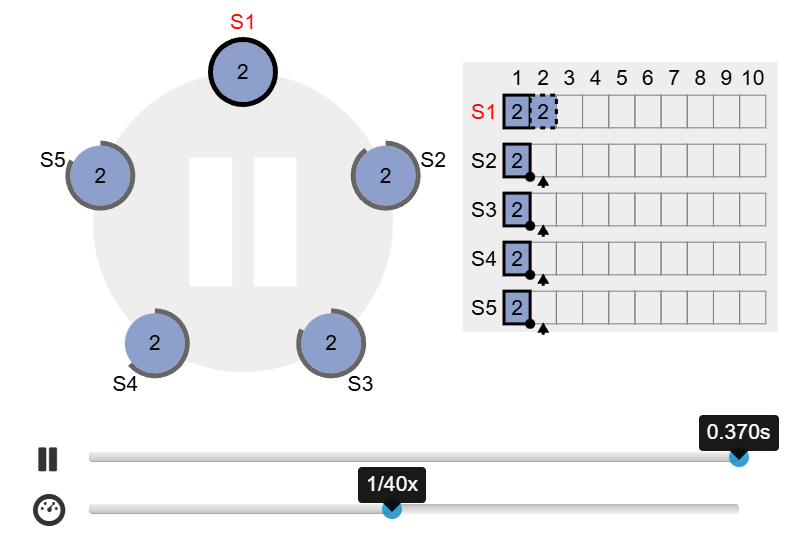
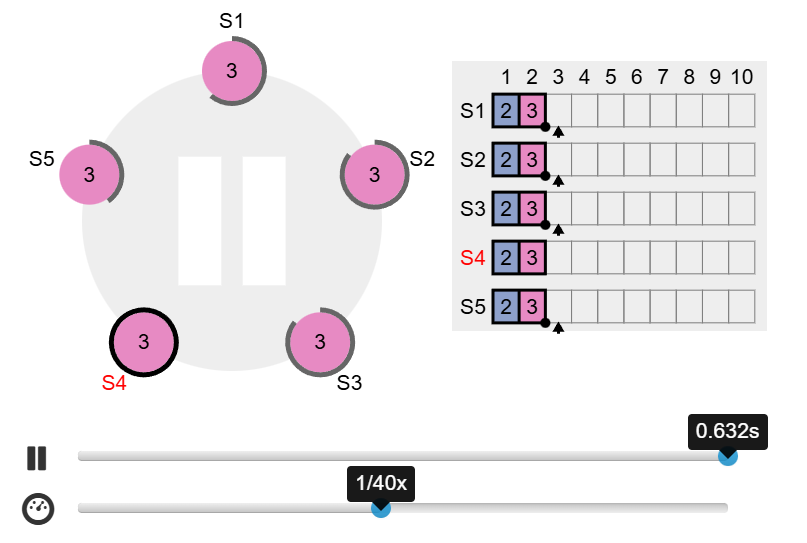
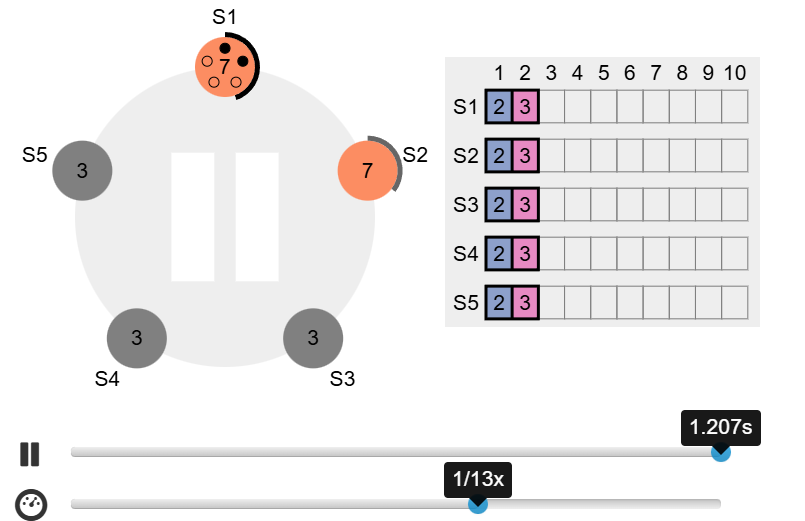
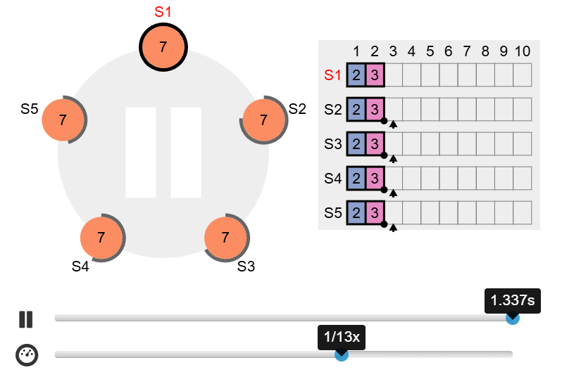

Assignment 5 Report
---------------------

# Team Members

# GitHub link to your (forked) repository

...

# Task 1

Note: Some questions require you to take screenshots. In that case, please join the screenshots and indicate in your answer which image refer to which screenshot.

1. What happens when Raft starts? Explain the process of electing a leader in the first
term.

Ans: When Raft starts, all nodes begin in the Follower state. Each follower has a randomized election timeout.
The first node whose timeout expires becomes a Candidate and starts a leader election. It increments the term number and sends RequestVote messages to all other nodes.
If the candidate receives votes from a majority of nodes (at least 3 out of 5), it becomes the Leader for the current term.
Once a leader is elected, it starts sending periodic Heartbeat messages to inform all other nodes that leadership is established.

2. Perform one request on the leader, wait until the leader is committed by all servers. Pause the simulation.
Then perform a new request on the leader. Take a screenshot, stop the leader and then resume the simulation.
Once, there is a new leader, perform a new request and then resume the previous leader. Once, this new request is committed by all servers, pause the simulation and take a screenshot. Explain what happened?

Ans: 
Screenshot 1:

Screenshot 2:

After the leader was elected, I first sent an operation that was successfully replicated and committed on all nodes.
When I paused the simulation and sent another request, this second log entry was only appended to the leader’s log but not committed and not replicated to a majority.
Then I stopped the leader. Because the uncommitted entry only existed on the leader, this entry became inconsistent and was therefore discarded. A new leader was elected from the remaining nodes.
When I performed a new request on the new leader, this entry was replicated to all nodes and committed.
When the old leader rejoined, Raft’s log-matching and log-consistency rules forced it to delete the uncommitted entry and overwrite its log with the new leader’s committed entries.
As a result, all nodes ended with identical logs again.

3. Using the same visualization, stop the current leader and two additional servers. After a few increments, pause the simulation and take a screenshot. Then resume all servers and restart the simulation. After the leader election, pause the simulation and take a screenshot. How do you explain the behavior of the system during the above exercise?

Ans: 
Screenshot 3:

Screenshot 4:

When the current leader and two additional servers are stopped, only two servers remain active in the cluster.
Because Raft requires a majority of nodes (3 out of 5) to elect a leader, the two remaining servers cannot form a majority.
No new leader can be elected and so the two running nodes repeatedly increase their term numbers and start new election timeouts.
Because they never receive votes from a majority and the term continues to increase. The logs do not change, because without a leader no new log entries can be added or committed.

After all nodes are resumed. All 5 servers become available again. A new leader S1 is successfully elected, because a majority is now possible. 
All nodes synchronize to the log of the newly elected leader. Once the leader sends AppendEntries to the other servers, all nodes end up with identical logs again.

# Task 2

1. Which server is the leader? Can there be multiple leaders? Justify your answer using the statuses from the different servers.
Ans:  curl http://localhost:8080/admin/status
   {'version': '0.3.14', 'revision': 'deprecated', 'self': TCPNode('node1:6000'), 'state': 0, 'leader': TCPNode('node2:6001'), 'has_quorum': True, 'partner_nodes_count': 2, 'partner_node_status_server_node2:6001': 2, 'partner_node_status_server_node3:6002': 2, 'readonly_nodes_count': 0, 'log_len': 2, 'last_applied': 4, 'commit_idx': 4, 'raft_term': 1, 'next_node_idx_count': 0, 'match_idx_count': 0, 'leader_commit_idx': 4, 'uptime': 611, 'self_code_version': 0, 'enabled_code_version': 0}%

      curl http://localhost:8081/admin/status
   {'version': '0.3.14', 'revision': 'deprecated', 'self': TCPNode('node2:6001'), 'state': 2, 'leader': TCPNode('node2:6001'), 'has_quorum': True, 'partner_nodes_count': 2, 'partner_node_status_server_node3:6002': 2, 'partner_node_status_server_node1:6000': 2, 'readonly_nodes_count': 0, 'log_len': 2, 'last_applied': 4, 'commit_idx': 4, 'raft_term': 1, 'next_node_idx_count': 2, 'next_node_idx_server_node3:6002': 5, 'next_node_idx_server_node1:6000': 5, 'match_idx_count': 2, 'match_idx_server_node3:6002': 4, 'match_idx_server_node1:6000': 4, 'leader_commit_idx': 4, 'uptime': 618, 'self_code_version': 0, 'enabled_code_version': 0}%

      curl http://localhost:8082/admin/status
   {'version': '0.3.14', 'revision': 'deprecated', 'self': TCPNode('node3:6002'), 'state': 0, 'leader': TCPNode('node2:6001'), 'has_quorum': True, 'partner_nodes_count': 2, 'partner_node_status_server_node1:6000': 2, 'partner_node_status_server_node2:6001': 2, 'readonly_nodes_count': 0, 'log_len': 2, 'last_applied': 4, 'commit_idx': 4, 'raft_term': 1, 'next_node_idx_count': 0, 'match_idx_count': 0, 'leader_commit_idx': 4, 'uptime': 625, 'self_code_version': 0, 'enabled_code_version': 0}%

The leader is node 2, since it is the only server in state 2, and it even says so: "'leader': TCPNode('node2:6001')"
A leader is required in Raft to receive the majority of votes during an election, thus 2 out of 3 nodes. 
Because only one node can obtain that majority in a term, there cannot be multiple leaders simultaniously.

2. Perform a PUT operation for the key "a" on the leader. Check the status of the different nodes. What changes have occurred and why (if any)?

Ans: After performing the PUT operation for the key "a" on the leader, all 3 nodes changed their Raft statuses:

The "log_len" variable (log lenght), increased from 2 to 3
The "commit_idx" variable (commit index) increased from 4 to 5
The "last_applied" variable (last applied index) increased from 4 to 5
The "leader_commit_idx" variable (leader commit index) increased from 4 to 5

This happened because of the simple reason that the leader first appends the PUT operation as a new log entry to its log,
later the leader replicates this entry to the followers (node 1 and node 3). 
As soon as a majority of nodes (here 2 out of 3) have stored the entry, the leaders marks it as committed, so that all nodes apply it to their state machines.
Finally, the value of the key "a" is updated ["cat", "dog"] on every server. 

3. Perform an APPEND operation for the key "a" on the leader. Check the status of the different nodes. What changes have occurred and why (if any)?

Ans: 

The "commit_idx" variable (commit index) increased from 5 to 6
The "last_applied" variable (last applied index) increased from 5 to 6
The "leader_commit_idx" variable (leader commit index) increased from 5 to 6
The "log_len" variable (log length) did not increase and stayed at 2. We're not 100% sure why this happened, but we think it's because of the automatic log compaction??

The increases happened because the leader first appends the APPEND operation as a new logical log entry. Then it 
replicates this entry to the followers (node 1 and node 3). Then, as soon as 2 out of 3 nodes (majority) have stored the entry, the leader marks it as committed, and all nodes apply the update to their state machines.

4. Perform a GET operation for the key "a" on the leader. Check the status of the different nodes. What changes have occured and why (if any)?

Ans: No changes occured at all. This is because the GET operation is read-only. It does not add anything to the Raft log. It does not 
get replicated to followers, and therefore does not affect the commit or applied indices. 
What the GET operation does, is simply returning the already commited value (now: ["cat", "dog", "mouse"]) without causing any changes in the Raft status across the nodes.

# Task 3

1. Shut down the server that acts as a leader. Report the status changes that you get from the servers that remain active after shutting down the leader. What is the new leader (if any)?

Ans: After shutting down node 2 (the leader), I got these statuses: 

for node 1: curl http://localhost:8080/admin/status
{'version': '0.3.14', 'revision': 'deprecated', 'self': TCPNode('node1:6000'), 'state': 0, 'leader': TCPNode('node3:6002'), 'has_quorum': True, 'partner_nodes_count': 2, 'partner_node_status_server_node3:6002': 2, 'partner_node_status_server_node2:6001': 0, 'readonly_nodes_count': 0, 'log_len': 3, 'last_applied': 3, 'commit_idx': 3, 'raft_term': 3, 'next_node_idx_count': 0, 'match_idx_count': 0, 'leader_commit_idx': 3, 'uptime': 34, 'self_code_version': 0, 'enabled_code_version': 0}%

for node 3: curl http://localhost:8082/admin/status
{'version': '0.3.14', 'revision': 'deprecated', 'self': TCPNode('node3:6002'), 'state': 2, 'leader': TCPNode('node3:6002'), 'has_quorum': True, 'partner_nodes_count': 2, 'partner_node_status_server_node1:6000': 2, 'partner_node_status_server_node2:6001': 0, 'readonly_nodes_count': 0, 'log_len': 3, 'last_applied': 3, 'commit_idx': 3, 'raft_term': 3, 'next_node_idx_count': 2, 'next_node_idx_server_node1:6000': 4, 'next_node_idx_server_node2:6001': 3, 'match_idx_count': 2, 'match_idx_server_node1:6000': 3, 'match_idx_server_node2:6001': 0, 'leader_commit_idx': 3, 'uptime': 40, 'self_code_version': 0, 'enabled_code_version': 0}%

So basically node 3 became the new leader. 
The Raft term, log_len, commit_idx, last_applied, leader_commit_idx variables increased. 

When the leader node, node2, was stopped, a new election for the leader was triggered.

1. Perform a PUT operation for the key "a" on the new leader. Then, restart the previous leader, and indicate the changes in status for the three servers. Indicate the result of a GET operation for the key "a" to the previous leader.

Ans: When a PUT operation was performed on the new leader, node3, the commit_idx and the last_applied variables on node 1 and node 3 increased to 4. 
Then we restarted the previous leader again (node 2), and noticed that it had rejoined the cluster as a follower ("state": 0). Additionally it updates its terms
to match the others and copied the missing log entry from mode 3. Also, all nodes show the same Raft state.  

After performing a GET request to the previous leader: curl http://localhost:8081/keys/a, we successfully got the new value of key "a", which means that node2 caught up with the cluster succcessfully.

3. Has the PUT operation been replicated? Indicate which steps lead to a new election and which ones do not. Justify your answer using the statuses returned by the servers.

Ans: Yes, the PUT operation on the new leader (node3) was successfully replicated to the whole cluster.
We can see this because, after restarting the old leader (node2), all three nodes show the same values for:

commit_idx = 4 (previously 3)

last_applied = 4 (previously 3)

leader = node3:6002

now and a GET request to node2 returns the updated value for key "a".
This means node2 pulled the missing log entry from node3 and applied it.

Only one step yet caused a new election: stopping the original leader (node2) before in task 3.1. 
After node2 was shut down, node1 and node3 (both followers) stopped receiving "heartbeats", which forced a new election.
This is visible in the status output through the increase in raft_term from 1 to 3, and through node3 changing its state to leader ('state' = 2).

All the other steps (performing PUT operation on the new leader, restarting the old leader) did not trigger an election.

4. Shut down two servers: first shut down a server that is not the leader, then shut down the leader. Report the status changes of the remaining server and explain what happened.

Ans: After shutting down a follower and then shutting down the leader, only one server (node1) remained running. 

Its status shows: curl http://localhost:8080/admin/status
{'version': '0.3.14', 'revision': 'deprecated', 'self': TCPNode('node1:6000'), 'state': 2, 'leader': TCPNode('node1:6000'), 'has_quorum': False, 'partner_nodes_count': 2, 'partner_node_status_server_node3:6002': 0, 'partner_node_status_server_node2:6001': 0, 'readonly_nodes_count': 0, 'log_len': 4, 'last_applied': 6, 'commit_idx': 6, 'raft_term': 8, 'next_node_idx_count': 2, 'next_node_idx_server_node3:6002': 7, 'next_node_idx_server_node2:6001': 7, 'match_idx_count': 2, 'match_idx_server_node3:6002': 6, 'match_idx_server_node2:6001': 6, 'leader_commit_idx': 6, 'uptime': 2690, 'self_code_version': 0, 'enabled_code_version': 0}%     

Its state is = 2 (leader)
its 'leader' variable is = node1
The has_quorum variable = False (since no majority available)

both partner nodes have status 0, which means they're offline: 'partner_node_status_server_node3:6002': 0, 'partner_node_status_server_node2:6001': 0
the Raft term increased to 8 because multiple election attempts were triggered when "heartbeats" stopped arriving.

This happens because the remaining server repeatedly starts new elections after the leader fails, incrementing the term each time. 
Eventually it elects itself as leader, but since it has no quorum (only 1 out of 3 servers is online), it cannot commit any new log entries!!!
The system is effectively unavailable for writes until at least one more server comes back online.

5. Can you perform GET, PUT, or APPEND operations in this system state? Justify your answer.

Ans: As mentioned in 3.4, "it cannot commit any new log entries!!! The system is effectively unavailable for writes until at least one more server comes back online", meaning that PUT and POST operations are NOT possible (Since there is not majority left --> has_quorum = false)
However, the GET operation still works, as long as it is a read from already commited data, since the node still has his local, commited state machine.

6. Restart the servers and note down the changes in status. Describe what happened.

Ans: After restarting the two offline servers (node2 and node3), the remaining node (node1) was still the leader. 

Node1: curl http://localhost:8080/admin/status  
{'version': '0.3.14', 'revision': 'deprecated', 'self': TCPNode('node1:6000'), 'state': 2, 'leader': TCPNode('node1:6000'), 'has_quorum': True, 'partner_nodes_count': 2, 'partner_node_status_server_node3:6002': 2, 'partner_node_status_server_node2:6001': 2, 'readonly_nodes_count': 0, 'log_len': 2, 'last_applied': 9, 'commit_idx': 9, 'raft_term': 9, 'next_node_idx_count': 2, 'next_node_idx_server_node3:6002': 10, 'next_node_idx_server_node2:6001': 10, 'match_idx_count': 2, 'match_idx_server_node3:6002': 9, 'match_idx_server_node2:6001': 9, 'leader_commit_idx': 9, 'uptime': 4005, 'self_code_version': 0, 'enabled_code_version': 0}%

Node2: curl http://localhost:8081/admin/status  
{'version': '0.3.14', 'revision': 'deprecated', 'self': TCPNode('node2:6001'), 'state': 0, 'leader': TCPNode('node1:6000'), 'has_quorum': True, 'partner_nodes_count': 2, 'partner_node_status_server_node3:6002': 2, 'partner_node_status_server_node1:6000': 2, 'readonly_nodes_count': 0, 'log_len': 2, 'last_applied': 9, 'commit_idx': 9, 'raft_term': 9, 'next_node_idx_count': 0, 'match_idx_count': 0, 'leader_commit_idx': 9, 'uptime': 380, 'self_code_version': 0, 'enabled_code_version': 0}%

Node 3: curl http://localhost:8082/admin/status  
{'version': '0.3.14', 'revision': 'deprecated', 'self': TCPNode('node3:6002'), 'state': 0, 'leader': TCPNode('node1:6000'), 'has_quorum': True, 'partner_nodes_count': 2, 'partner_node_status_server_node1:6000': 2, 'partner_node_status_server_node2:6001': 2, 'readonly_nodes_count': 0, 'log_len': 2, 'last_applied': 9, 'commit_idx': 9, 'raft_term': 9, 'next_node_idx_count': 0, 'match_idx_count': 0, 'leader_commit_idx': 9, 'uptime': 392, 'self_code_version': 0, 'enabled_code_version': 0}%

When the other servers rejoined, they contacted node1 and accepted it as the current leader.
From the statuses, we see that:

'state' = 2 (leader) on node1

'state' = 0 (followers) on node2 and node3

All nodes now show has_quorum = True

raft_term increased to 9

commit_idx, last_applied, and log_len are identical on all nodes
(commit_idx = 9, last_applied = 9, log_len = 2)

This shows that node1 successfully replicated its log to the returning servers. Both node2 and node3 received all missing log entries from node1, and applied them to reach the same state and became followers.

## Network Partition

For the first experiment, create a network partition with 2 servers (including the leader)
on the first partition and the 3 other servers on the other one. Indicate the changes that occur in the status of a server on the first partition and a server on the second partition. Reconnect the partitions and indicate what happens. What are the similarities and differences between the implementation of Raft used by your key/value service (based on the PySyncObj library) and the one shown in the Secret Lives of Data illustration from Task 1? How do you justify the differences?

Answer for the first part of the question (before reconnecting): After creating the network partition, the two groups of servers behaved differently!!

In the first partition (node1 and node3, which included the original leader (node 3)), both servers lost contact with the majority of the cluster (node 2, 4 and 5). Because they no longer had a quorum, they were unable to elect a leader. 
Their status shows:
Node1: {'version': '0.3.14', 'revision': 'deprecated', 'self': TCPNode('node3:6002'), 'state': 0, 'leader': None, 'has_quorum': False, 'partner_nodes_count': 4, 'partner_node_status_server_node5:6004': 0, 'partner_node_status_server_node2:6001': 0, 'partner_node_status_server_node1:6000': 2, 'partner_node_status_server_node4:6003': 0, 'readonly_nodes_count': 0, 'log_len': 2, 'last_applied': 2, 'commit_idx': 2, 'raft_term': 72, 'next_node_idx_count': 4, 'next_node_idx_server_node5:6004': 3, 'next_node_idx_server_node2:6001': 3, 'next_node_idx_server_node1:6000': 3, 'next_node_idx_server_node4:6003': 3, 'match_idx_count': 4, 'match_idx_server_node5:6004': 2, 'match_idx_server_node2:6001': 2, 'match_idx_server_node1:6000': 2, 'match_idx_server_node4:6003': 2, 'leader_commit_idx': 2, 'uptime': 424, 'self_code_version': 0, 'enabled_code_version': 0}
Node3: {'version': '0.3.14', 'revision': 'deprecated', 'self': TCPNode('node1:6000'), 'state': 1, 'leader': None, 'has_quorum': False, 'partner_nodes_count': 4, 'partner_node_status_server_node2:6001': 0, 'partner_node_status_server_node5:6004': 0, 'partner_node_status_server_node4:6003': 0, 'partner_node_status_server_node3:6002': 2, 'readonly_nodes_count': 0, 'log_len': 2, 'last_applied': 2, 'commit_idx': 2, 'raft_term': 72, 'next_node_idx_count': 0, 'match_idx_count': 0, 'leader_commit_idx': 2, 'uptime': 424, 'self_code_version': 0, 'enabled_code_version': 0}%

Significant fields:
both nodes have: leader = None and has_quorum = False. 

The Raft term on these servers increased repeatedly (to a extremely high value of 72) as they continued to start new election attempts that could never succeed. Their commit_idx and last_applied values did not increase, since a minority partition cannot commit new log entries!

In the second partition (node2, node4, and node5), the servers still had a majority. These three nodes elected a new leader (node5). 
Their status shows:
Node 2: {'version': '0.3.14', 'revision': 'deprecated', 'self': TCPNode('node2:6001'), 'state': 0, 'leader': TCPNode('node5:6004'), 'has_quorum': True, 'partner_nodes_count': 4, 'partner_node_status_server_node5:6004': 2, 'partner_node_status_server_node3:6002': 2, 'partner_node_status_server_node1:6000': 0, 'partner_node_status_server_node4:6003': 2, 'readonly_nodes_count': 0, 'log_len': 2, 'last_applied': 3, 'commit_idx': 3, 'raft_term': 3, 'next_node_idx_count': 0, 'match_idx_count': 0, 'leader_commit_idx': 3, 'uptime': 1161, 'self_code_version': 0, 'enabled_code_version': 0}
Node 4: {'version': '0.3.14', 'revision': 'deprecated', 'self': TCPNode('node4:6003'), 'state': 0, 'leader': TCPNode('node5:6004'), 'has_quorum': True, 'partner_nodes_count': 4, 'partner_node_status_server_node5:6004': 2, 'partner_node_status_server_node3:6002': 2, 'partner_node_status_server_node2:6001': 2, 'partner_node_status_server_node1:6000': 0, 'readonly_nodes_count': 0, 'log_len': 2, 'last_applied': 3, 'commit_idx': 3, 'raft_term': 3, 'next_node_idx_count': 0, 'match_idx_count': 0, 'leader_commit_idx': 3, 'uptime': 1161, 'self_code_version': 0, 'enabled_code_version': 0}
Node 5: {'version': '0.3.14', 'revision': 'deprecated', 'self': TCPNode('node5:6004'), 'state': 2, 'leader': TCPNode('node5:6004'), 'has_quorum': True, 'partner_nodes_count': 4, 'partner_node_status_server_node1:6000': 0, 'partner_node_status_server_node4:6003': 2, 'partner_node_status_server_node2:6001': 2, 'partner_node_status_server_node3:6002': 0, 'readonly_nodes_count': 0, 'log_len': 2, 'last_applied': 3, 'commit_idx': 3, 'raft_term': 3, 'next_node_idx_count': 4, 'next_node_idx_server_node1:6000': 3, 'next_node_idx_server_node4:6003': 4, 'next_node_idx_server_node2:6001': 4, 'next_node_idx_server_node3:6002': 4, 'match_idx_count': 4, 'match_idx_server_node1:6000': 0, 'match_idx_server_node4:6003': 3, 'match_idx_server_node2:6001': 3, 'match_idx_server_node3:6002': 0, 'leader_commit_idx': 3, 'uptime': 1161, 'self_code_version': 0, 'enabled_code_version': 0}%                                 

significant fields:
has_quorum = True, state = 2 on the new leader (node 5), and a stable, low Raft term (term = 3). Because this partition had quorum, it could continue to make progress: log_len, commit_idx, and last_applied all increased as normal.

In summary, the minority partition could not elect a leader or commit log entries, while the majority partition continued operating normaly and elected a new leader. This matches the Raft safety rule that only a majority of nodes can select a leader and commit new entries (as seen in the previous tasks in 3)

Answer for the second part of the question (after reconnecting): After reconnecting them, we got this result: 

Node 1: {'version': '0.3.14', 'revision': 'deprecated', 'self': TCPNode('node1:6000'), 'state': 0, 'leader': TCPNode('node5:6004'), 'has_quorum': True, 'partner_nodes_count': 4, 'partner_node_status_server_node2:6001': 2, 'partner_node_status_server_node5:6004': 2, 'partner_node_status_server_node4:6003': 2, 'partner_node_status_server_node3:6002': 2, 'readonly_nodes_count': 0, 'log_len': 4, 'last_applied': 4, 'commit_idx': 4, 'raft_term': 1681, 'next_node_idx_count': 0, 'match_idx_count': 0, 'leader_commit_idx': 4, 'uptime': 1711, 'self_code_version': 0, 'enabled_code_version': 0}
Node 2: {'version': '0.3.14', 'revision': 'deprecated', 'self': TCPNode('node2:6001'), 'state': 0, 'leader': TCPNode('node5:6004'), 'has_quorum': True, 'partner_nodes_count': 4, 'partner_node_status_server_node5:6004': 2, 'partner_node_status_server_node3:6002': 2, 'partner_node_status_server_node1:6000': 2, 'partner_node_status_server_node4:6003': 2, 'readonly_nodes_count': 0, 'log_len': 3, 'last_applied': 4, 'commit_idx': 4, 'raft_term': 1681, 'next_node_idx_count': 0, 'match_idx_count': 0, 'leader_commit_idx': 4, 'uptime': 1711, 'self_code_version': 0, 'enabled_code_version': 0}
Node 3: {'version': '0.3.14', 'revision': 'deprecated', 'self': TCPNode('node3:6002'), 'state': 0, 'leader': TCPNode('node5:6004'), 'has_quorum': True, 'partner_nodes_count': 4, 'partner_node_status_server_node5:6004': 2, 'partner_node_status_server_node2:6001': 2, 'partner_node_status_server_node1:6000': 2, 'partner_node_status_server_node4:6003': 2, 'readonly_nodes_count': 0, 'log_len': 4, 'last_applied': 4, 'commit_idx': 4, 'raft_term': 1681, 'next_node_idx_count': 4, 'next_node_idx_server_node5:6004': 3, 'next_node_idx_server_node2:6001': 3, 'next_node_idx_server_node1:6000': 3, 'next_node_idx_server_node4:6003': 3, 'match_idx_count': 4, 'match_idx_server_node5:6004': 2, 'match_idx_server_node2:6001': 2, 'match_idx_server_node1:6000': 2, 'match_idx_server_node4:6003': 2, 'leader_commit_idx': 4, 'uptime': 1712, 'self_code_version': 0, 'enabled_code_version': 0}
Node 4: {'version': '0.3.14', 'revision': 'deprecated', 'self': TCPNode('node4:6003'), 'state': 0, 'leader': TCPNode('node5:6004'), 'has_quorum': True, 'partner_nodes_count': 4, 'partner_node_status_server_node5:6004': 2, 'partner_node_status_server_node3:6002': 2, 'partner_node_status_server_node2:6001': 2, 'partner_node_status_server_node1:6000': 2, 'readonly_nodes_count': 0, 'log_len': 3, 'last_applied': 4, 'commit_idx': 4, 'raft_term': 1681, 'next_node_idx_count': 0, 'match_idx_count': 0, 'leader_commit_idx': 4, 'uptime': 1711, 'self_code_version': 0, 'enabled_code_version': 0}
Node 5: {'version': '0.3.14', 'revision': 'deprecated', 'self': TCPNode('node5:6004'), 'state': 2, 'leader': TCPNode('node5:6004'), 'has_quorum': True, 'partner_nodes_count': 4, 'partner_node_status_server_node1:6000': 2, 'partner_node_status_server_node4:6003': 2, 'partner_node_status_server_node2:6001': 2, 'partner_node_status_server_node3:6002': 2, 'readonly_nodes_count': 0, 'log_len': 3, 'last_applied': 4, 'commit_idx': 4, 'raft_term': 1681, 'next_node_idx_count': 4, 'next_node_idx_server_node1:6000': 5, 'next_node_idx_server_node4:6003': 5, 'next_node_idx_server_node2:6001': 5, 'next_node_idx_server_node3:6002': 5, 'match_idx_count': 4, 'match_idx_server_node1:6000': 4, 'match_idx_server_node4:6003': 4, 'match_idx_server_node2:6001': 4, 'match_idx_server_node3:6002': 4, 'leader_commit_idx': 4, 'uptime': 1711, 'self_code_version': 0, 'enabled_code_version': 0}%

After reconnecting the partitions, all five servers were able to reach each other again. As a result, every node reports has_quorum = True, and they all agree on a single leader (node5). 
The nodes that were previously isolated in the minority partition (node1 and node3) stepped down and became followers of this leader. Their logs were then brought back into sync with the majority, 
which is reflected by all nodes showing commit_idx = 4 and last_applied = 4. The very high Raft term is explained by the repeated, unsuccessful election attempts made by the minority partition during the split. 
Once reconnected, all nodes accepted the current term and leader, and the system returned to a consistent state.

Finally, the comparison between the implementation of Raft (based on the PySyncObj library) and the one shown in the Secret Lives of Data illustration:

The behavior of PySyncObj largely matches the protocol shown in The Secret Lives of Data! The majority partition elects a new leader and continues to commit log entries, 
while the minority partition cannot make progress because it lacks a quorum. After reconnection, all nodes return to a consistent state with a single leader.

The differences come from implementation details. PySyncObj increases the Raft term very quickly in the minority partition because it repeatedly starts failed elections, 
whereas the visualization simplifies this and keeps terms small. PySyncObj also performs internal log compaction, so log_len does not always grow as shown in the illustration. 
These differences are expected, because the visualization is meant to teach the basic Raft concepts, while PySyncObj is a real-world library that includes optimizations and internal mechanisms not shown in the simplified model.

For the second experiment, create a network partition with 3 servers (including the
leader) on the first partition and the 2 other servers on the other one. Indicate the changes that occur in the status of a server on the first partition and a server on the second partition. Reconnect the partitions and indicate what happens. How does the implementation of Raft used by your key/value service (based on the PySyncObj library) compare to the one shown in the Secret Lives of Data illustration from Task 1?

Ans: 

# Task 4

1. Raft uses a leader election algorithm based on randomized timeouts and majority voting, but other leader election algorithms exist. One of them is the bully algorithm, which is described in Section 5.4.1 of the Distributed Systems book by van Steen and Tanenbaum. Imagine you update the PySyncObject library to use the bully algorithm for Raft (as described in the Distributed Systems book) instead of randomized timeouts and majority voting. What would happen in the first network partition from Task 3?

Ans: If Raft used the bully algorithm instead of randomized timeouts and majority voting, the behavior in the first network partition would break Raft's safety guarantee.
    In the bully algorithm, the node with the highest ID always becomes the leader, as long as it can communicate with at least one other node.
    During the network partition in Task 3, the smaller partition could still contain the node with the highest ID. Because the bully algorithm does not require a majority, that node would declare itself leader.
    This leads to two leaders at the same time (one in each partition) and causes log divergence, conflicting commits, and loss of consistency.

2. Why is it that Raft cannot handle Byzantine failure? Explain in your own words.

Ans: Raft cannot tolerate Byzantine failures because it assumes that all nodes are either correct or simply crash. 
    In Raft, nodes must follow the protocol faithfully. They must send honest votes, replicate the correct log entries and respect term numbers. 
    If a node behaves arbitrarily or maliciously, for example by lying about votes or pretending to be a leader.
    Then Raft has no built-in mechanism to detect or handle this. Since Raft relies on majority voting and trust in the correctness of messages, a Byzantine node can break safety by confusing the other nodes or causing them to commit inconsistent logs. 
    Therefore, Raft cannot guarantee correctness when nodes have Byzantine failure.
